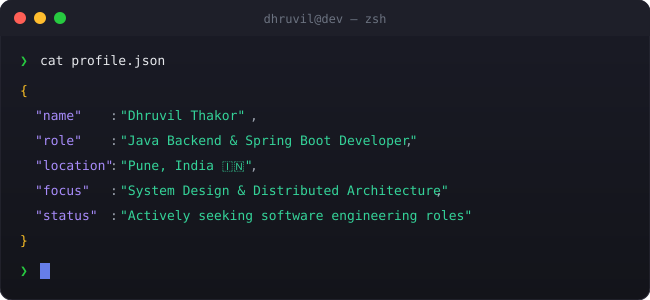

  

# 💫 About Me:
### About Me I am a Backend Software Engineer specializing in Java, Spring Boot, and distributed systems, currently building high-throughput microservices at Barclays.   Building scalable backend infrastructure is like tuning a high-performance engine—I focus on stripping away bottlenecks, optimizing data pipelines, and ensuring fault tolerance so the system runs fast and stable under heavy loads. Whether it's implementing Raft consensus in Go, building low-latency C++ proxies, or integrating RAG pipelines with Spring AI, I care about clean architecture and system resilience.

## 🌐 Socials:
  

# 💻 Tech Stack:
                                     
# 📊 GitHub Stats:
 
 

---

<!-- Proudly created with GPRM ( https://gprm.itsvg.in ) -->
